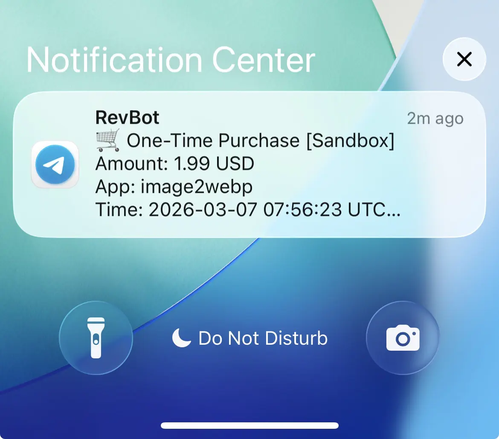

# App Store Webhook Telegram

Receives [App Store Server Notifications v2](https://developer.apple.com/documentation/appstoreservernotifications), verifies JWS signatures using Apple's official library, and forwards events to a Telegram chat.

## How It Works

1. Apple sends a signed POST request to your webhook endpoint after each subscription event
2. The server verifies the JWS signature using Apple's root certificates
3. A formatted message is sent to your Telegram chat



## Setup

### 1. Create a Telegram Bot

1. Open Telegram and search for **@BotFather**
2. Send `/newbot` and follow the prompts (choose a name and username)
3. BotFather will reply with your **Bot Token** — looks like `123456789:ABCDefghIJKlmnopQRStuvWXyz`
4. Copy it — this is your `TELEGRAM_BOT_TOKEN`

### 2. Get Your Chat ID

**For a personal chat:**

1. Search for **@userinfobot** on Telegram
2. Send it any message
3. Open this URL in your browser (replace `<TOKEN>` with your bot token):
   ```
   https://api.telegram.org/bot<TOKEN>/getUpdates
   ```
4. Find `"chat":{"id":...}` in the response — the negative number (e.g. `-1001234567890`) is your `TELEGRAM_CHAT_ID`

**For a group or channel:**

1. Add your bot to the group/channel and grant it permission to post messages
2. Send a message in the group, then open this URL in your browser (replace `<TOKEN>` with your bot token):
   ```
   https://api.telegram.org/bot<TOKEN>/getUpdates
   ```
3. Find `"chat":{"id":...}` in the response — the negative number (e.g. `-1001234567890`) is your `TELEGRAM_CHAT_ID`

### 3. Configure Environment Variables

```bash
cp .env.example .env.local
```

Edit `.env.local`:

```env
TELEGRAM_BOT_TOKEN=123456789:ABCDefghIJKlmnopQRStuvWXyz
TELEGRAM_CHAT_ID=-1001234567890

# One line per app: APP_<SLUG>=<bundleId>:<appAppleId>
APP_IMAGE2WEBP=com.yourcompany.image2webp:1234567890
APP_MYAPP=com.yourcompany.myapp:9876543210
```

| Variable             | Description                                                    |
| -------------------- | -------------------------------------------------------------- |
| `TELEGRAM_BOT_TOKEN` | Token from @BotFather                                          |
| `TELEGRAM_CHAT_ID`   | Your personal ID (positive number) or group/channel (negative) |
| `APP_<SLUG>`         | `<bundleId>:<appAppleId>` — slug becomes the URL path          |

### 4. Register Webhook URLs in App Store Connect

Go to **App Store Connect → Your App → App Information → App Store Server Notifications**:

- **Sandbox URL** — your ngrok/tunnel URL (for testing)
- **Production URL** — your deployed Vercel URL

Both should point to `POST /api/apple/<app-slug>`, e.g. `/api/apple/image2webp`.

## Local Development

Install dependencies:

```bash
pnpm install
```

Start the local server:

```bash
pnpm local
# Listening on http://localhost:3003
```

Expose it to the internet with ngrok:

```bash
ngrok http 3003
```

Paste the ngrok HTTPS URL into App Store Connect → Sandbox Server URL.

## Deploy to Vercel

```bash
pnpm run deploy
```

Then go to **Vercel Dashboard → Your Project → Settings → Environment Variables** and add `TELEGRAM_BOT_TOKEN`, `TELEGRAM_CHAT_ID`, and all your `APP_*` variables.

Paste the production Vercel URL into App Store Connect → Production Server URL.

## Testing with a Sandbox Account

### 1. Create a Sandbox Tester Account

1. Go to [App Store Connect](https://appstoreconnect.apple.com) → **Users and Access** → **Sandbox Testers**
2. Click **+** to create a new tester
3. Fill in the details — use a real email address you control (it will receive a verification email)
4. Choose a country/region that matches the currency you want to test
5. Click **Invite** and verify the email address

> Each sandbox account can only be used on one device at a time. Create multiple accounts if you need to test on multiple devices.

### 2. Sign In on iPhone

1. On your iPhone, go to **Settings → Developer → Sandbox Apple Account**
2. Sign in with your sandbox tester account

> No need to sign out of your real Apple ID. The sandbox account is managed separately under Developer settings.

### 3. Configure Sandbox Server URL

Make sure your webhook Sandbox URL is set in App Store Connect:

**App Store Connect → Your App → App Information → App Store Server Notifications → Sandbox Server URL**

Set it to your ngrok URL (local dev) or your Vercel URL.

### 4. Trigger a Test Purchase

1. Open your app on the iPhone
2. Tap any in-app purchase or subscription button
3. A sign-in prompt will appear — sign in with your **sandbox tester account** (not your real Apple ID)
4. Confirm the purchase (no real money is charged)
5. Watch your Telegram chat for the notification

### 5. Sandbox Subscription Renewal Rates

Sandbox subscriptions renew much faster than production:

| Production duration | Sandbox renewal interval |
| ------------------- | ------------------------ |
| 1 week              | 3 minutes                |
| 1 month             | 5 minutes                |
| 2 months            | 10 minutes               |
| 3 months            | 15 minutes               |
| 6 months            | 30 minutes               |
| 1 year              | 1 hour                   |

Each subscription auto-renews up to 12 times in sandbox, then expires — you'll receive `DID_RENEW` and eventually `EXPIRED` notifications.

### 6. Manage Sandbox Subscriptions on Device

To cancel, refund, or change a sandbox subscription:

**iPhone → Settings → Developer → Sandbox Apple Account**

From here you can sign in with your sandbox tester and manage active subscriptions directly.

## Adding a New App

Add a line to your `.env.local` (no code changes needed):

```env
APP_MYAPP=com.yourcompany.myapp:1234567890
```

The variable suffix (`MYAPP` → `myapp`) becomes the URL slug: `POST /api/apple/myapp`.

Then add the Vercel environment variable in the dashboard and redeploy.

## Webhook Endpoint

```
POST /api/apple/:app
```

Always returns `200 OK` to Apple (even on verification failure) to prevent retries.

## Sponsored By

This project is built and maintained to support [Image2WebP](https://apps.apple.com/app/id6670599252) — convert images to WebP/AVIF format quickly and securely, reducing file size by up to 80%.

## License

MIT © 2026 givebest
